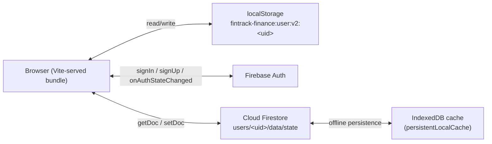
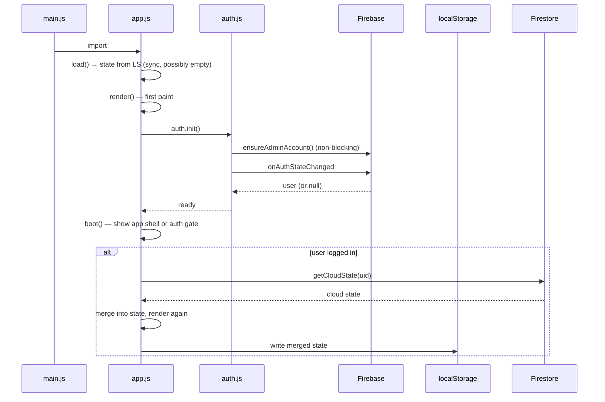
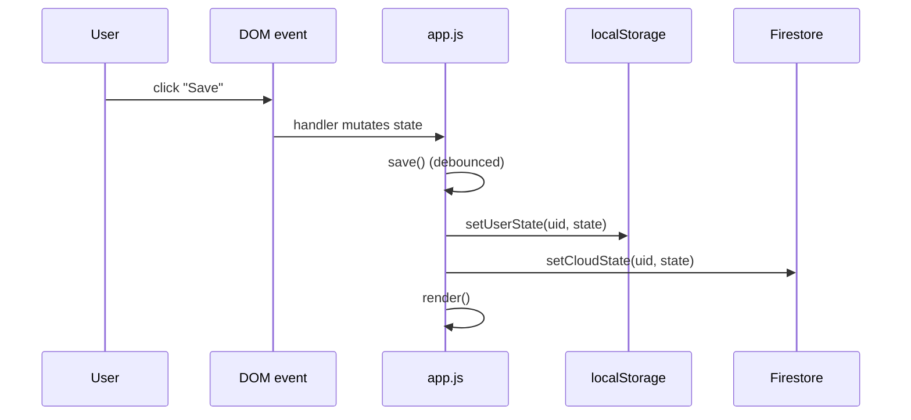
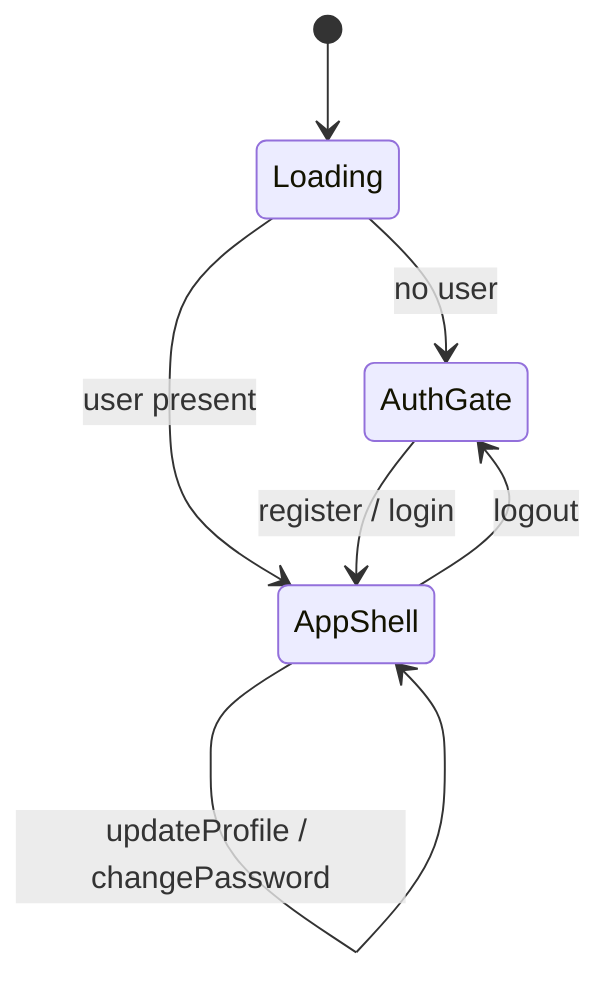

# FinTrack — Project Workflow

Internal architecture and data-flow reference. Read this before changing how state, auth, or sync works.

## High-level architecture



Three persistence layers, in priority order from "fastest first paint" to "source of truth":

1. **localStorage** — synchronous, used for instant render before any network call resolves.
2. **IndexedDB cache (Firestore SDK)** — automatic offline cache. Survives reloads, used when offline.
3. **Cloud Firestore** — source of truth. Writes always go here; cross-device sync happens via this.

## Module map

| File | Responsibility |
|---|---|
| [src/main.js](fintrack/src/main.js) | Boot entry; imports `app.js` |
| [src/app.js](fintrack/src/app.js) | UI, state object, render loop, all feature logic |
| [src/auth.js](fintrack/src/auth.js) | Firebase Auth wrapper: `init / register / login / logout / updateProfile / changePassword / getCurrentUser` |
| [src/firebase.js](fintrack/src/firebase.js) | Firebase app/Auth/Firestore singletons; configuration check |
| [src/storage.js](fintrack/src/storage.js) | Local + cloud persistence (per-user keyed) |
| [src/styles.css](fintrack/src/styles.css) | All styling |

## Boot flow



Step by step:

1. `app.js` loads. At module top, `state = normalizeState(load())` synchronously hydrates from localStorage using whatever user is in `getUserCache()` (the last user logged in on this device).
2. `boot()` runs `auth.init()` which:
    - Triggers `ensureAdminAccount()` (idempotent — admin already exists after first run).
    - Subscribes to `onAuthStateChanged` once and resolves with the current user.
3. If no user, `boot()` reveals `#auth-gate` and the app waits for sign-in.
4. After sign-in, `boot()` reveals `#app-shell`, registers handlers, and kicks off `getCloudState(uid)` in the background.
5. When the cloud state arrives, it overrides local state and `render()` is called again.

## Data flow on a user action



`save()` is debounced; both the local and cloud writes happen on the same tick. The cloud write is async — local UI never waits for it.

## Auth flow



- **Sign up** — `register({ name, email, password })` calls `createUserWithEmailAndPassword`, then `updateProfile({ displayName: name })`, caches the user in `localStorage`, and resolves.
- **Login** — `login({ email, password })` calls `signInWithEmailAndPassword` and caches the user.
- **Logout** — `logout()` clears the cache and signs out.
- **Profile / password** — `updateProfile` and `changePassword` re-authenticate when needed.

The `auth-user-cache` localStorage key (`fintrack:auth-user-cache:v1`) lets the app paint immediately on reload without waiting for `onAuthStateChanged`. Firebase's own auth state is still the truth — the cache is just a hint.

## Per-user isolation

Every read and write is keyed by `currentUser.id` (the Firebase UID):

- **Local key**: `fintrack-finance:user:v2:<uid>`
- **Cloud doc**: `users/<uid>/data/state`
- **Security rule**: `request.auth.uid == userId`

Even if a user got hold of another user's data via JS console, Firestore would reject the request server-side.

## Cross-device sync

- Device A writes a change → both LS and Firestore updated.
- Device B opens the app → reads its (stale or empty) LS → renders → fetches `users/<uidB>/data/state` from Firestore → merges → re-renders.
- Subsequent saves on B propagate to Firestore and become visible on A on the next reload.

This implementation is "last write wins per save". There is no live `onSnapshot` listener — sync happens at boot. To make it real-time, replace the `getCloudState` call in `boot()` with `onSnapshot(doc(...))` and apply changes incrementally.

## Offline support

`firebase.js` calls `initializeFirestore` with:

```js
{
  localCache: persistentLocalCache({ tabManager: persistentMultipleTabManager() })
}
```

Effects:

- All Firestore reads are served from IndexedDB if offline.
- Writes are queued locally and replayed when the network returns.
- Multiple browser tabs share the same cache without conflicting.

## State shape

```ts
state = {
  view: 'dashboard' | 'transactions' | 'budgets' | 'goals' | 'recurring' | 'reports' | 'settings',
  period: 'YYYY-MM',           // current month being viewed
  currency: 'INR' | 'USD' | …,
  theme: 'light' | 'dark',
  accounts: Account[],
  transactions: Transaction[],
  budgets: Record<category, number>,
  goals: Goal[],
  recurring: Recurring[],
}
```

`normalizeState` is the gatekeeper. Any state coming from disk, cloud, or import is run through it. Any future field should be normalised there.

## Adding a feature — checklist

1. **State** — add the new field to the default state and to `normalizeState`.
2. **UI** — add a render function in `app.js` that uses `escapeHtml(...)` for any user-controlled string.
3. **Mutation** — write a handler that updates `state` and calls `save()`.
4. **Persistence** — nothing extra needed; `save()` writes the whole state to LS + Firestore.
5. **Migration** — if the field changes shape, update `normalizeState` so old saved data still loads.
6. **Test** — sign up a fresh user, do the action, hard-reload, confirm data survives.

## Known limitations

- The whole `state` object is written on every save. Fine for personal use; would need finer-grained writes for very large datasets.
- Single 802 KB JS bundle (Firebase + Chart.js dominate). Code-split via `manualChunks` if startup latency becomes a concern.
- No mobile native app — PWA install only.

## Common pitfalls

- **Don't bypass `normalizeState`.** Any code path that puts data into `state` should run it through `normalizeState` (or `normalizeTransaction` etc. for individual items).
- **Don't interpolate raw user data into `innerHTML`.** Use `escapeHtml(...)` everywhere user content is shown.
- **Don't forget `save()`.** Mutating state without calling `save()` means the change won't persist anywhere.
- **Don't write to Firestore directly from feature code.** Go through `storage.setCloudState`.
- **Don't store secrets in code.** All Firebase config comes from `import.meta.env.VITE_*`. Admin password too.
